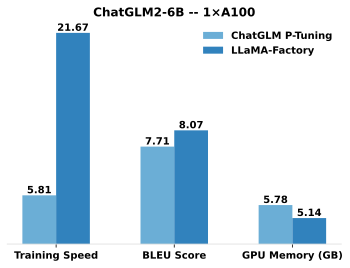

[](https://github.com/hiyouga/LLaMA-Factory/stargazers)
[](https://github.com/hiyouga/LLaMA-Factory/commits/main)
[](https://github.com/hiyouga/LLaMA-Factory/graphs/contributors)
[](https://github.com/hiyouga/LLaMA-Factory/actions/workflows/tests.yml)
[](https://pypi.org/project/llamafactory/)
[](https://scholar.google.com/scholar?cites=12620864006390196564)
[](https://github.com/hiyouga/LLaMA-Factory/pulls)

[](https://twitter.com/llamafactory_ai)
[](https://discord.gg/rKfvV9r9FK)
[](https://gitcode.com/zhengyaowei/LLaMA-Factory)

[](https://colab.research.google.com/drive/1eRTPn37ltBbYsISy9Aw2NuI2Aq5CQrD9?usp=sharing)
[](https://gallery.pai-ml.com/#/preview/deepLearning/nlp/llama_factory)
[](https://huggingface.co/spaces/hiyouga/LLaMA-Board)
[](https://modelscope.cn/studios/hiyouga/LLaMA-Board)
[](https://aws.amazon.com/cn/blogs/china/a-one-stop-code-free-model-fine-tuning-deployment-platform-based-on-sagemaker-and-llama-factory/)

<h3 align="center">
    Easily fine-tune 100+ large language models with zero-code <a href="#quickstart">CLI</a> and <a href="#fine-tuning-with-llama-board-gui-powered-by-gradio">Web UI</a>
</h3>
<p align="center">
    <picture>
        
    </picture>
</p>

👋 Join our [WeChat](assets/wechat.jpg) or [NPU user group](assets/wechat_npu.jpg).

\[ English | [中文](README_zh.md) \]

**Fine-tuning a large language model can be easy as...**

https://github.com/user-attachments/assets/7c96b465-9df7-45f4-8053-bf03e58386d3

Choose your path:

- **Documentation (WIP)**: https://llamafactory.readthedocs.io/zh-cn/latest/
- **Colab**: https://colab.research.google.com/drive/1eRTPn37ltBbYsISy9Aw2NuI2Aq5CQrD9?usp=sharing
- **Local machine**: Please refer to [usage](#getting-started)
- **PAI-DSW**: [Llama3 Example](https://gallery.pai-ml.com/#/preview/deepLearning/nlp/llama_factory) | [Qwen2-VL Example](https://gallery.pai-ml.com/#/preview/deepLearning/nlp/llama_factory_qwen2vl)
- **Amazon SageMaker**: [Blog](https://aws.amazon.com/cn/blogs/china/a-one-stop-code-free-model-fine-tuning-deployment-platform-based-on-sagemaker-and-llama-factory/)

> [!NOTE]
> Except for the above links, all other websites are unauthorized third-party websites. Please carefully use them.

## Table of Contents

- [Features](#features)
- [Benchmark](#benchmark)
- [Changelog](#changelog)
- [Supported Models](#supported-models)
- [Supported Training Approaches](#supported-training-approaches)
- [Provided Datasets](#provided-datasets)
- [Requirement](#requirement)
- [Getting Started](#getting-started)
  - [Installation](#installation)
  - [Data Preparation](#data-preparation)
  - [Quickstart](#quickstart)
  - [Fine-Tuning with LLaMA Board GUI](#fine-tuning-with-llama-board-gui-powered-by-gradio)
  - [Build Docker](#build-docker)
  - [Deploy with OpenAI-style API and vLLM](#deploy-with-openai-style-api-and-vllm)
  - [Download from ModelScope Hub](#download-from-modelscope-hub)
  - [Download from Modelers Hub](#download-from-modelers-hub)
  - [Use W&B Logger](#use-wb-logger)
  - [Use SwanLab Logger](#use-swanlab-logger)
- [Projects using LLaMA Factory](#projects-using-llama-factory)
- [License](#license)
- [Citation](#citation)
- [Acknowledgement](#acknowledgement)

## Features

- **Various models**: LLaMA, LLaVA, Mistral, Mixtral-MoE, Qwen, Qwen2-VL, DeepSeek, Yi, Gemma, ChatGLM, Phi, etc.
- **Integrated methods**: (Continuous) pre-training, (multimodal) supervised fine-tuning, reward modeling, PPO, DPO, KTO, ORPO, etc.
- **Scalable resources**: 16-bit full-tuning, freeze-tuning, LoRA and 2/3/4/5/6/8-bit QLoRA via AQLM/AWQ/GPTQ/LLM.int8/HQQ/EETQ.
- **Advanced algorithms**: [GaLore](https://github.com/jiaweizzhao/GaLore), [BAdam](https://github.com/Ledzy/BAdam), [APOLLO](https://github.com/zhuhanqing/APOLLO), [Adam-mini](https://github.com/zyushun/Adam-mini), DoRA, LongLoRA, LLaMA Pro, Mixture-of-Depths, LoRA+, LoftQ and PiSSA.
- **Practical tricks**: [FlashAttention-2](https://github.com/Dao-AILab/flash-attention), [Unsloth](https://github.com/unslothai/unsloth), [Liger Kernel](https://github.com/linkedin/Liger-Kernel), RoPE scaling, NEFTune and rsLoRA.
- **Wide tasks**: Multi-turn dialogue, tool using, image understanding, visual grounding, video recognition, audio understanding, etc.
- **Experiment monitors**: LlamaBoard, TensorBoard, Wandb, MLflow, SwanLab, etc.
- **Faster inference**: OpenAI-style API, Gradio UI and CLI with vLLM worker.

### Day-N Support for Fine-Tuning Cutting-Edge Models

| Support Date | Model Name                                                 |
| ------------ | ---------------------------------------------------------- |
| Day 0        | Qwen2.5 / Qwen2-VL / QwQ / QvQ / InternLM3 / MiniCPM-o-2.6 |
| Day 1        | Llama 3 / GLM-4 / Mistral Small / PaliGemma2               |

## Benchmark

Compared to ChatGLM's [P-Tuning](https://github.com/THUDM/ChatGLM2-6B/tree/main/ptuning), LLaMA Factory's LoRA tuning offers up to **3.7 times faster** training speed with a better Rouge score on the advertising text generation task. By leveraging 4-bit quantization technique, LLaMA Factory's QLoRA further improves the efficiency regarding the GPU memory.



<details><summary>Definitions</summary>

- **Training Speed**: the number of training samples processed per second during the training. (bs=4, cutoff_len=1024)
- **Rouge Score**: Rouge-2 score on the development set of the [advertising text generation](https://aclanthology.org/D19-1321.pdf) task. (bs=4, cutoff_len=1024)
- **GPU Memory**: Peak GPU memory usage in 4-bit quantized training. (bs=1, cutoff_len=1024)
- We adopt `pre_seq_len=128` for ChatGLM's P-Tuning and `lora_rank=32` for LLaMA Factory's LoRA tuning.

</details>

## Changelog

[23/06/03] Now we support quantized training and inference (aka QLoRA). Try `--quantization_bit 4/8` argument to work with quantized model. (experimental feature)

[23/05/31] Now we support training the BLOOM & BLOOMZ models in this repo. Try `--model_name_or_path bigscience/bloomz-7b1-mt` argument to use the BLOOMZ model.

## Supported Models

- [LLaMA](https://github.com/facebookresearch/llama) (7B/13B/33B/65B)
- [BLOOM](https://huggingface.co/bigscience/bloom) & [BLOOMZ](https://huggingface.co/bigscience/bloomz) (560M/1.1B/1.7B/3B/7.1B/176B)

## Supported Training Approaches

| Approach               |     Full-tuning    |    Freeze-tuning   |       LoRA         |       QLoRA        |
| ---------------------- | ------------------ | ------------------ | ------------------ | ------------------ |
| Pre-Training           | :white_check_mark: | :white_check_mark: | :white_check_mark: | :white_check_mark: |
| Supervised Fine-Tuning | :white_check_mark: | :white_check_mark: | :white_check_mark: | :white_check_mark: |
| Reward Modeling        | :white_check_mark: | :white_check_mark: | :white_check_mark: | :white_check_mark: |
| PPO Training           | :white_check_mark: | :white_check_mark: | :white_check_mark: | :white_check_mark: |
| DPO Training           | :white_check_mark: | :white_check_mark: | :white_check_mark: | :white_check_mark: |
| KTO Training           | :white_check_mark: | :white_check_mark: | :white_check_mark: | :white_check_mark: |
| ORPO Training          | :white_check_mark: | :white_check_mark: | :white_check_mark: | :white_check_mark: |
| SimPO Training         | :white_check_mark: | :white_check_mark: | :white_check_mark: | :white_check_mark: |

> [!TIP]
> The implementation details of PPO can be found in [this blog](https://newfacade.github.io/notes-on-reinforcement-learning/17-ppo-trl.html).

## Provided Datasets

- For pre-training:
  - [Wiki Demo](data/wiki_demo.txt)
- For supervised fine-tuning:
  - [Stanford Alpaca](https://github.com/tatsu-lab/stanford_alpaca)
  - [Stanford Alpaca (Chinese)](https://github.com/ymcui/Chinese-LLaMA-Alpaca)
  - [GPT-4 Generated Data](https://github.com/Instruction-Tuning-with-GPT-4/GPT-4-LLM)
  - [BELLE 2M](https://huggingface.co/datasets/BelleGroup/train_2M_CN)
  - [BELLE 1M](https://huggingface.co/datasets/BelleGroup/train_1M_CN)
  - [BELLE 0.5M](https://huggingface.co/datasets/BelleGroup/train_0.5M_CN)
  - [BELLE Dialogue 0.4M](https://huggingface.co/datasets/BelleGroup/generated_chat_0.4M)
  - [BELLE School Math 0.25M](https://huggingface.co/datasets/BelleGroup/school_math_0.25M)
  - [BELLE Multiturn Chat 0.8M](https://huggingface.co/datasets/BelleGroup/multiturn_chat_0.8M)
  - [Guanaco Dataset](https://huggingface.co/datasets/JosephusCheung/GuanacoDataset)
  - [Firefly 1.1M](https://huggingface.co/datasets/YeungNLP/firefly-train-1.1M)
  - [CodeAlpaca 20k](https://huggingface.co/datasets/sahil2801/CodeAlpaca-20k)
  - [Alpaca CoT](https://huggingface.co/datasets/QingyiSi/Alpaca-CoT)
  - [Web QA (Chinese)](https://huggingface.co/datasets/suolyer/webqa)
  - [UltraChat](https://github.com/thunlp/UltraChat)
- For reward model training:
  - [HH-RLHF](https://huggingface.co/datasets/Anthropic/hh-rlhf)
  - [GPT-4 Generated Data](https://github.com/Instruction-Tuning-with-GPT-4/GPT-4-LLM)
  - [GPT-4 Generated Data (Chinese)](https://github.com/Instruction-Tuning-with-GPT-4/GPT-4-LLM)

Please refer to [data/README.md](data/README.md) for details.

Some datasets require confirmation before using them, so we recommend logging in with your Hugging Face account using these commands.

```bash
pip install --upgrade huggingface_hub
huggingface-cli login
```

## Requirement

- Python 3.8+ and PyTorch 1.13.1+
- 🤗Transformers, Datasets, Accelerate, PEFT and TRL
- protobuf, cpm_kernels and sentencepiece
- jieba, rouge_chinese and nltk (used at evaluation)
- gradio and mdtex2html (used in web_demo.py)

And **powerful GPUs**!

## Getting Started

### Data Preparation (optional)

Please refer to `data/example_dataset` for checking the details about the format of dataset files. You can either use a single `.json` file or a [dataset loading script](https://huggingface.co/docs/datasets/dataset_script) with multiple files to create a custom dataset.

Note: please update `data/dataset_info.json` to use your custom dataset. About the format of this file, please refer to `data/README.md`.

### Dependence Installation (optional)

```bash
llamafactory-cli train examples/train_lora/llama3_lora_sft.yaml
llamafactory-cli chat examples/inference/llama3_lora_sft.yaml
llamafactory-cli export examples/merge_lora/llama3_lora_sft.yaml
```

See [examples/README.md](examples/README.md) for advanced usage (including distributed training).

> [!TIP]
> Use `llamafactory-cli help` to show help information.

### Fine-Tuning with LLaMA Board GUI (powered by [Gradio](https://github.com/gradio-app/gradio))

```bash
llamafactory-cli webui
```

### Build Docker

For CUDA users:

```bash
cd docker/docker-cuda/
docker compose up -d
docker compose exec llamafactory bash
```

For Ascend NPU users:

```bash
cd docker/docker-npu/
docker compose up -d
docker compose exec llamafactory bash
```

For AMD ROCm users:

```bash
cd docker/docker-rocm/
docker compose up -d
docker compose exec llamafactory bash
```

<details><summary>Build without Docker Compose</summary>

For CUDA users:

```bash
docker build -f ./docker/docker-cuda/Dockerfile \
    --build-arg INSTALL_BNB=false \
    --build-arg INSTALL_VLLM=false \
    --build-arg INSTALL_DEEPSPEED=false \
    --build-arg INSTALL_FLASHATTN=false \
    --build-arg PIP_INDEX=https://pypi.org/simple \
    -t llamafactory:latest .

docker run -dit --gpus=all \
    -v ./hf_cache:/root/.cache/huggingface \
    -v ./ms_cache:/root/.cache/modelscope \
    -v ./om_cache:/root/.cache/openmind \
    -v ./data:/app/data \
    -v ./output:/app/output \
    -p 7860:7860 \
    -p 8000:8000 \
    --shm-size 16G \
    --name llamafactory \
    llamafactory:latest

docker exec -it llamafactory bash
```

For Ascend NPU users:

```bash
# Choose docker image upon your environment
docker build -f ./docker/docker-npu/Dockerfile \
    --build-arg INSTALL_DEEPSPEED=false \
    --build-arg PIP_INDEX=https://pypi.org/simple \
    -t llamafactory:latest .

# Change `device` upon your resources
docker run -dit \
    -v ./hf_cache:/root/.cache/huggingface \
    -v ./ms_cache:/root/.cache/modelscope \
    -v ./om_cache:/root/.cache/openmind \
    -v ./data:/app/data \
    -v ./output:/app/output \
    -v /usr/local/dcmi:/usr/local/dcmi \
    -v /usr/local/bin/npu-smi:/usr/local/bin/npu-smi \
    -v /usr/local/Ascend/driver:/usr/local/Ascend/driver \
    -v /etc/ascend_install.info:/etc/ascend_install.info \
    -p 7860:7860 \
    -p 8000:8000 \
    --device /dev/davinci0 \
    --device /dev/davinci_manager \
    --device /dev/devmm_svm \
    --device /dev/hisi_hdc \
    --shm-size 16G \
    --name llamafactory \
    llamafactory:latest

docker exec -it llamafactory bash
```

For AMD ROCm users:

```bash
docker build -f ./docker/docker-rocm/Dockerfile \
    --build-arg INSTALL_BNB=false \
    --build-arg INSTALL_VLLM=false \
    --build-arg INSTALL_DEEPSPEED=false \
    --build-arg INSTALL_FLASHATTN=false \
    --build-arg PIP_INDEX=https://pypi.org/simple \
    -t llamafactory:latest .

docker run -dit \
    -v ./hf_cache:/root/.cache/huggingface \
    -v ./ms_cache:/root/.cache/modelscope \
    -v ./om_cache:/root/.cache/openmind \
    -v ./data:/app/data \
    -v ./output:/app/output \
    -v ./saves:/app/saves \
    -p 7860:7860 \
    -p 8000:8000 \
    --device /dev/kfd \
    --device /dev/dri \
    --shm-size 16G \
    --name llamafactory \
    llamafactory:latest

docker exec -it llamafactory bash
```

</details>

<details><summary>Details about volume</summary>

- `hf_cache`: Utilize Hugging Face cache on the host machine. Reassignable if a cache already exists in a different directory.
- `ms_cache`: Similar to Hugging Face cache but for ModelScope users.
- `om_cache`: Similar to Hugging Face cache but for Modelers users.
- `data`: Place datasets on this dir of the host machine so that they can be selected on LLaMA Board GUI.
- `output`: Set export dir to this location so that the merged result can be accessed directly on the host machine.

</details>

### Deploy with OpenAI-style API and vLLM

```bash
API_PORT=8000 llamafactory-cli api examples/inference/llama3_vllm.yaml
```

> [!TIP]
> Visit [this page](https://platform.openai.com/docs/api-reference/chat/create) for API document.
>
> Examples: [Image understanding](scripts/api_example/test_image.py) | [Function calling](scripts/api_example/test_toolcall.py)

### Download from ModelScope Hub

If you have trouble with downloading models and datasets from Hugging Face, you can use ModelScope.

```bash
export USE_MODELSCOPE_HUB=1 # `set USE_MODELSCOPE_HUB=1` for Windows
```

Train the model by specifying a model ID of the ModelScope Hub as the `model_name_or_path`. You can find a full list of model IDs at [ModelScope Hub](https://modelscope.cn/models), e.g., `LLM-Research/Meta-Llama-3-8B-Instruct`.

### Download from Modelers Hub

You can also use Modelers Hub to download models and datasets.

```bash
export USE_OPENMIND_HUB=1 # `set USE_OPENMIND_HUB=1` for Windows
```

Train the model by specifying a model ID of the Modelers Hub as the `model_name_or_path`. You can find a full list of model IDs at [Modelers Hub](https://modelers.cn/models), e.g., `TeleAI/TeleChat-7B-pt`.

### Use W&B Logger

To use [Weights & Biases](https://wandb.ai) for logging experimental results, you need to add the following arguments to yaml files.

```yaml
report_to: wandb
run_name: test_run # optional
```

Set `WANDB_API_KEY` to [your key](https://wandb.ai/authorize) when launching training tasks to log in with your W&B account.

### Use SwanLab Logger

To use [SwanLab](https://github.com/SwanHubX/SwanLab) for logging experimental results, you need to add the following arguments to yaml files.

```yaml
use_swanlab: true
swanlab_run_name: test_run # optional
```

When launching training tasks, you can log in to SwanLab in three ways:

1. Add `swanlab_api_key=<your_api_key>` to the yaml file, and set it to your [API key](https://swanlab.cn/settings).
2. Set the environment variable `SWANLAB_API_KEY` to your [API key](https://swanlab.cn/settings).
3. Use the `swanlab login` command to complete the login.

## Projects using LLaMA Factory

If you have a project that should be incorporated, please contact via email or create a pull request.

<details><summary>Click to show</summary>

1. Wang et al. ESRL: Efficient Sampling-based Reinforcement Learning for Sequence Generation. 2023. [[arxiv]](https://arxiv.org/abs/2308.02223)
1. Yu et al. Open, Closed, or Small Language Models for Text Classification? 2023. [[arxiv]](https://arxiv.org/abs/2308.10092)
1. Wang et al. UbiPhysio: Support Daily Functioning, Fitness, and Rehabilitation with Action Understanding and Feedback in Natural Language. 2023. [[arxiv]](https://arxiv.org/abs/2308.10526)
1. Luceri et al. Leveraging Large Language Models to Detect Influence Campaigns in Social Media. 2023. [[arxiv]](https://arxiv.org/abs/2311.07816)
1. Zhang et al. Alleviating Hallucinations of Large Language Models through Induced Hallucinations. 2023. [[arxiv]](https://arxiv.org/abs/2312.15710)
1. Wang et al. Know Your Needs Better: Towards Structured Understanding of Marketer Demands with Analogical Reasoning Augmented LLMs. KDD 2024. [[arxiv]](https://arxiv.org/abs/2401.04319)
1. Wang et al. CANDLE: Iterative Conceptualization and Instantiation Distillation from Large Language Models for Commonsense Reasoning. ACL 2024. [[arxiv]](https://arxiv.org/abs/2401.07286)
1. Choi et al. FACT-GPT: Fact-Checking Augmentation via Claim Matching with LLMs. 2024. [[arxiv]](https://arxiv.org/abs/2402.05904)
1. Zhang et al. AutoMathText: Autonomous Data Selection with Language Models for Mathematical Texts. 2024. [[arxiv]](https://arxiv.org/abs/2402.07625)
1. Lyu et al. KnowTuning: Knowledge-aware Fine-tuning for Large Language Models. 2024. [[arxiv]](https://arxiv.org/abs/2402.11176)
1. Yang et al. LaCo: Large Language Model Pruning via Layer Collaps. 2024. [[arxiv]](https://arxiv.org/abs/2402.11187)
1. Bhardwaj et al. Language Models are Homer Simpson! Safety Re-Alignment of Fine-tuned Language Models through Task Arithmetic. 2024. [[arxiv]](https://arxiv.org/abs/2402.11746)
1. Yang et al. Enhancing Empathetic Response Generation by Augmenting LLMs with Small-scale Empathetic Models. 2024. [[arxiv]](https://arxiv.org/abs/2402.11801)
1. Yi et al. Generation Meets Verification: Accelerating Large Language Model Inference with Smart Parallel Auto-Correct Decoding. ACL 2024 Findings. [[arxiv]](https://arxiv.org/abs/2402.11809)
1. Cao et al. Head-wise Shareable Attention for Large Language Models. 2024. [[arxiv]](https://arxiv.org/abs/2402.11819)
1. Zhang et al. Enhancing Multilingual Capabilities of Large Language Models through Self-Distillation from Resource-Rich Languages. 2024. [[arxiv]](https://arxiv.org/abs/2402.12204)
1. Kim et al. Efficient and Effective Vocabulary Expansion Towards Multilingual Large Language Models. 2024. [[arxiv]](https://arxiv.org/abs/2402.14714)
1. Yu et al. KIEval: A Knowledge-grounded Interactive Evaluation Framework for Large Language Models. ACL 2024. [[arxiv]](https://arxiv.org/abs/2402.15043)
1. Huang et al. Key-Point-Driven Data Synthesis with its Enhancement on Mathematical Reasoning. 2024. [[arxiv]](https://arxiv.org/abs/2403.02333)
1. Duan et al. Negating Negatives: Alignment without Human Positive Samples via Distributional Dispreference Optimization. 2024. [[arxiv]](https://arxiv.org/abs/2403.03419)
1. Xie and Schwertfeger. Empowering Robotics with Large Language Models: osmAG Map Comprehension with LLMs. 2024. [[arxiv]](https://arxiv.org/abs/2403.08228)
1. Wu et al. Large Language Models are Parallel Multilingual Learners. 2024. [[arxiv]](https://arxiv.org/abs/2403.09073)
1. Zhang et al. EDT: Improving Large Language Models' Generation by Entropy-based Dynamic Temperature Sampling. 2024. [[arxiv]](https://arxiv.org/abs/2403.14541)
1. Weller et al. FollowIR: Evaluating and Teaching Information Retrieval Models to Follow Instructions. 2024. [[arxiv]](https://arxiv.org/abs/2403.15246)
1. Hongbin Na. CBT-LLM: A Chinese Large Language Model for Cognitive Behavioral Therapy-based Mental Health Question Answering. COLING 2024. [[arxiv]](https://arxiv.org/abs/2403.16008)
1. Zan et al. CodeS: Natural Language to Code Repository via Multi-Layer Sketch. 2024. [[arxiv]](https://arxiv.org/abs/2403.16443)
1. Liu et al. Extensive Self-Contrast Enables Feedback-Free Language Model Alignment. 2024. [[arxiv]](https://arxiv.org/abs/2404.00604)
1. Luo et al. BAdam: A Memory Efficient Full Parameter Training Method for Large Language Models. 2024. [[arxiv]](https://arxiv.org/abs/2404.02827)
1. Du et al. Chinese Tiny LLM: Pretraining a Chinese-Centric Large Language Model. 2024. [[arxiv]](https://arxiv.org/abs/2404.04167)
1. Ma et al. Parameter Efficient Quasi-Orthogonal Fine-Tuning via Givens Rotation. ICML 2024. [[arxiv]](https://arxiv.org/abs/2404.04316)
1. Liu et al. Dynamic Generation of Personalities with Large Language Models. 2024. [[arxiv]](https://arxiv.org/abs/2404.07084)
1. Shang et al. How Far Have We Gone in Stripped Binary Code Understanding Using Large Language Models. 2024. [[arxiv]](https://arxiv.org/abs/2404.09836)
1. Huang et al. LLMTune: Accelerate Database Knob Tuning with Large Language Models. 2024. [[arxiv]](https://arxiv.org/abs/2404.11581)
1. Deng et al. Text-Tuple-Table: Towards Information Integration in Text-to-Table Generation via Global Tuple Extraction. 2024. [[arxiv]](https://arxiv.org/abs/2404.14215)
1. Acikgoz et al. Hippocrates: An Open-Source Framework for Advancing Large Language Models in Healthcare. 2024. [[arxiv]](https://arxiv.org/abs/2404.16621)
1. Zhang et al. Small Language Models Need Strong Verifiers to Self-Correct Reasoning. ACL 2024 Findings. [[arxiv]](https://arxiv.org/abs/2404.17140)
1. Zhou et al. FREB-TQA: A Fine-Grained Robustness Evaluation Benchmark for Table Question Answering. NAACL 2024. [[arxiv]](https://arxiv.org/abs/2404.18585)
1. Xu et al. Large Language Models for Cyber Security: A Systematic Literature Review. 2024. [[arxiv]](https://arxiv.org/abs/2405.04760)
1. Dammu et al. "They are uncultured": Unveiling Covert Harms and Social Threats in LLM Generated Conversations. 2024. [[arxiv]](https://arxiv.org/abs/2405.05378)
1. Yi et al. A safety realignment framework via subspace-oriented model fusion for large language models. 2024. [[arxiv]](https://arxiv.org/abs/2405.09055)
1. Lou et al. SPO: Multi-Dimensional Preference Sequential Alignment With Implicit Reward Modeling. 2024. [[arxiv]](https://arxiv.org/abs/2405.12739)
1. Zhang et al. Getting More from Less: Large Language Models are Good Spontaneous Multilingual Learners. 2024. [[arxiv]](https://arxiv.org/abs/2405.13816)
1. Zhang et al. TS-Align: A Teacher-Student Collaborative Framework for Scalable Iterative Finetuning of Large Language Models. 2024. [[arxiv]](https://arxiv.org/abs/2405.20215)
1. Zihong Chen. Sentence Segmentation and Sentence Punctuation Based on XunziALLM. 2024. [[paper]](https://aclanthology.org/2024.lt4hala-1.30)
1. Gao et al. The Best of Both Worlds: Toward an Honest and Helpful Large Language Model. 2024. [[arxiv]](https://arxiv.org/abs/2406.00380)
1. Wang and Song. MARS: Benchmarking the Metaphysical Reasoning Abilities of Language Models with a Multi-task Evaluation Dataset. 2024. [[arxiv]](https://arxiv.org/abs/2406.02106)
1. Hu et al. Computational Limits of Low-Rank Adaptation (LoRA) for Transformer-Based Models. 2024. [[arxiv]](https://arxiv.org/abs/2406.03136)
1. Ge et al. Time Sensitive Knowledge Editing through Efficient Finetuning. ACL 2024. [[arxiv]](https://arxiv.org/abs/2406.04496)
1. Tan et al. Peer Review as A Multi-Turn and Long-Context Dialogue with Role-Based Interactions. 2024. [[arxiv]](https://arxiv.org/abs/2406.05688)
1. Song et al. Turbo Sparse: Achieving LLM SOTA Performance with Minimal Activated Parameters. 2024. [[arxiv]](https://arxiv.org/abs/2406.05955)
1. Gu et al. RWKV-CLIP: A Robust Vision-Language Representation Learner. 2024. [[arxiv]](https://arxiv.org/abs/2406.06973)
1. Chen et al. Advancing Tool-Augmented Large Language Models: Integrating Insights from Errors in Inference Trees. 2024. [[arxiv]](https://arxiv.org/abs/2406.07115)
1. Zhu et al. Are Large Language Models Good Statisticians?. 2024. [[arxiv]](https://arxiv.org/abs/2406.07815)
1. Li et al. Know the Unknown: An Uncertainty-Sensitive Method for LLM Instruction Tuning. 2024. [[arxiv]](https://arxiv.org/abs/2406.10099)
1. Ding et al. IntentionQA: A Benchmark for Evaluating Purchase Intention Comprehension Abilities of Language Models in E-commerce. 2024. [[arxiv]](https://arxiv.org/abs/2406.10173)
1. He et al. COMMUNITY-CROSS-INSTRUCT: Unsupervised Instruction Generation for Aligning Large Language Models to Online Communities. 2024. [[arxiv]](https://arxiv.org/abs/2406.12074)
1. Lin et al. FVEL: Interactive Formal Verification Environment with Large Language Models via Theorem Proving. 2024. [[arxiv]](https://arxiv.org/abs/2406.14408)
1. Treutlein et al. Connecting the Dots: LLMs can Infer and Verbalize Latent Structure from Disparate Training Data. 2024. [[arxiv]](https://arxiv.org/abs/2406.14546)
1. Feng et al. SS-Bench: A Benchmark for Social Story Generation and Evaluation. 2024. [[arxiv]](https://arxiv.org/abs/2406.15695)
1. Feng et al. Self-Constructed Context Decompilation with Fined-grained Alignment Enhancement. 2024. [[arxiv]](https://arxiv.org/abs/2406.17233)
1. Liu et al. Large Language Models for Cuffless Blood Pressure Measurement From Wearable Biosignals. 2024. [[arxiv]](https://arxiv.org/abs/2406.18069)
1. Iyer et al. Exploring Very Low-Resource Translation with LLMs: The University of Edinburgh's Submission to AmericasNLP 2024 Translation Task. AmericasNLP 2024. [[paper]](https://aclanthology.org/2024.americasnlp-1.25)
1. Li et al. Calibrating LLMs with Preference Optimization on Thought Trees for Generating Rationale in Science Question Scoring. 2024. [[arxiv]](https://arxiv.org/abs/2406.19949)
1. Yang et al. Financial Knowledge Large Language Model. 2024. [[arxiv]](https://arxiv.org/abs/2407.00365)
1. Lin et al. DogeRM: Equipping Reward Models with Domain Knowledge through Model Merging. 2024. [[arxiv]](https://arxiv.org/abs/2407.01470)
1. Bako et al. Evaluating the Semantic Profiling Abilities of LLMs for Natural Language Utterances in Data Visualization. 2024. [[arxiv]](https://arxiv.org/abs/2407.06129)
1. Huang et al. RoLoRA: Fine-tuning Rotated Outlier-free LLMs for Effective Weight-Activation Quantization. 2024. [[arxiv]](https://arxiv.org/abs/2407.08044)
1. Jiang et al. LLM-Collaboration on Automatic Science Journalism for the General Audience. 2024. [[arxiv]](https://arxiv.org/abs/2407.09756)
1. Inouye et al. Applied Auto-tuning on LoRA Hyperparameters. 2024. [[paper]](https://scholarcommons.scu.edu/cseng_senior/272/)
1. Qi et al. Research on Tibetan Tourism Viewpoints information generation system based on LLM. 2024. [[arxiv]](https://arxiv.org/abs/2407.13561)
1. Xu et al. Course-Correction: Safety Alignment Using Synthetic Preferences. 2024. [[arxiv]](https://arxiv.org/abs/2407.16637)
1. Sun et al. LAMBDA: A Large Model Based Data Agent. 2024. [[arxiv]](https://arxiv.org/abs/2407.17535)
1. Zhu et al. CollectiveSFT: Scaling Large Language Models for Chinese Medical Benchmark with Collective Instructions in Healthcare. 2024. [[arxiv]](https://arxiv.org/abs/2407.19705)
1. Yu et al. Correcting Negative Bias in Large Language Models through Negative Attention Score Alignment. 2024. [[arxiv]](https://arxiv.org/abs/2408.00137)
1. Xie et al. The Power of Personalized Datasets: Advancing Chinese Composition Writing for Elementary School through Targeted Model Fine-Tuning. IALP 2024. [[paper]](https://www.asianlp.sg/conferences/ialp2024/proceedings/papers/IALP2024_P055.pdf)
1. Liu et al. Instruct-Code-Llama: Improving Capabilities of Language Model in Competition Level Code Generation by Online Judge Feedback. ICIC 2024. [[paper]](https://link.springer.com/chapter/10.1007/978-981-97-5669-8_11)
1. Wang et al. Cybernetic Sentinels: Unveiling the Impact of Safety Data Selection on Model Security in Supervised Fine-Tuning. ICIC 2024. [[paper]](https://link.springer.com/chapter/10.1007/978-981-97-5669-8_23)
1. Xia et al. Understanding the Performance and Estimating the Cost of LLM Fine-Tuning. 2024. [[arxiv]](https://arxiv.org/abs/2408.04693)
1. Zeng et al. Perceive, Reflect, and Plan: Designing LLM Agent for Goal-Directed City Navigation without Instructions. 2024. [[arxiv]](https://arxiv.org/abs/2408.04168)
1. Xia et al. Using Pre-trained Language Model for Accurate ESG Prediction. FinNLP 2024. [[paper]](https://aclanthology.org/2024.finnlp-2.1/)
1. Liang et al. I-SHEEP: Self-Alignment of LLM from Scratch through an Iterative Self-Enhancement Paradigm. 2024. [[arxiv]](https://arxiv.org/abs/2408.08072)
1. Bai et al. Aligning Large Language Model with Direct Multi-Preference Optimization for Recommendation. CIKM 2024. [[paper]](https://dl.acm.org/doi/10.1145/3627673.3679611)
1. **[StarWhisper](https://github.com/Yu-Yang-Li/StarWhisper)**: A large language model for Astronomy, based on ChatGLM2-6B and Qwen-14B.
1. **[DISC-LawLLM](https://github.com/FudanDISC/DISC-LawLLM)**: A large language model specialized in Chinese legal domain, based on Baichuan-13B, is capable of retrieving and reasoning on legal knowledge.
1. **[Sunsimiao](https://github.com/X-D-Lab/Sunsimiao)**: A large language model specialized in Chinese medical domain, based on Baichuan-7B and ChatGLM-6B.
1. **[CareGPT](https://github.com/WangRongsheng/CareGPT)**: A series of large language models for Chinese medical domain, based on LLaMA2-7B and Baichuan-13B.
1. **[MachineMindset](https://github.com/PKU-YuanGroup/Machine-Mindset/)**: A series of MBTI Personality large language models, capable of giving any LLM 16 different personality types based on different datasets and training methods.
1. **[Luminia-13B-v3](https://huggingface.co/Nekochu/Luminia-13B-v3)**: A large language model specialized in generate metadata for stable diffusion. [[demo]](https://huggingface.co/spaces/Nekochu/Luminia-13B_SD_Prompt)
1. **[Chinese-LLaVA-Med](https://github.com/BUAADreamer/Chinese-LLaVA-Med)**: A multimodal large language model specialized in Chinese medical domain, based on LLaVA-1.5-7B.
1. **[AutoRE](https://github.com/THUDM/AutoRE)**: A document-level relation extraction system based on large language models.
1. **[NVIDIA RTX AI Toolkit](https://github.com/NVIDIA/RTX-AI-Toolkit)**: SDKs for fine-tuning LLMs on Windows PC for NVIDIA RTX.
1. **[LazyLLM](https://github.com/LazyAGI/LazyLLM)**: An easy and lazy way for building multi-agent LLMs applications and supports model fine-tuning via LLaMA Factory.
1. **[RAG-Retrieval](https://github.com/NLPJCL/RAG-Retrieval)**: A full pipeline for RAG retrieval model fine-tuning, inference, and distillation. [[blog]](https://zhuanlan.zhihu.com/p/987727357)
1. **[360-LLaMA-Factory](https://github.com/Qihoo360/360-LLaMA-Factory)**: A modified library that supports long sequence SFT & DPO using ring attention.
1. **[Sky-T1](https://novasky-ai.github.io/posts/sky-t1/)**: An o1-like model fine-tuned by NovaSky AI with very small cost.

</details>

## License

This repository is licensed under the [Apache-2.0 License](LICENSE).

Please follow the model licenses to use the corresponding model weights: [Baichuan 2](https://huggingface.co/baichuan-inc/Baichuan2-7B-Base/blob/main/Community%20License%20for%20Baichuan%202%20Model.pdf) / [BLOOM](https://huggingface.co/spaces/bigscience/license) / [ChatGLM3](https://github.com/THUDM/ChatGLM3/blob/main/MODEL_LICENSE) / [Command R](https://cohere.com/c4ai-cc-by-nc-license) / [DeepSeek](https://github.com/deepseek-ai/DeepSeek-LLM/blob/main/LICENSE-MODEL) / [Falcon](https://huggingface.co/tiiuae/falcon-180B/blob/main/LICENSE.txt) / [Gemma](https://ai.google.dev/gemma/terms) / [GLM-4](https://huggingface.co/THUDM/glm-4-9b/blob/main/LICENSE) / [GPT-2](https://github.com/openai/gpt-2/blob/master/LICENSE) / [Granite](LICENSE) / [Index](https://huggingface.co/IndexTeam/Index-1.9B/blob/main/LICENSE) / [InternLM](https://github.com/InternLM/InternLM#license) / [Llama](https://github.com/facebookresearch/llama/blob/main/MODEL_CARD.md) / [Llama 2 (LLaVA-1.5)](https://ai.meta.com/llama/license/) / [Llama 3](https://llama.meta.com/llama3/license/) / [MiniCPM](https://github.com/OpenBMB/MiniCPM/blob/main/MiniCPM%20Model%20License.md) / [Mistral/Mixtral/Pixtral](LICENSE) / [OLMo](LICENSE) / [Phi-1.5/Phi-2](https://huggingface.co/microsoft/phi-1_5/resolve/main/Research%20License.docx) / [Phi-3/Phi-4](https://huggingface.co/microsoft/Phi-3-mini-4k-instruct/blob/main/LICENSE) / [Qwen](https://github.com/QwenLM/Qwen/blob/main/Tongyi%20Qianwen%20LICENSE%20AGREEMENT) / [Skywork](https://huggingface.co/Skywork/Skywork-13B-base/blob/main/Skywork%20Community%20License.pdf) / [StarCoder 2](https://huggingface.co/spaces/bigcode/bigcode-model-license-agreement) / [TeleChat2](https://huggingface.co/Tele-AI/telechat-7B/blob/main/TeleChat%E6%A8%A1%E5%9E%8B%E7%A4%BE%E5%8C%BA%E8%AE%B8%E5%8F%AF%E5%8D%8F%E8%AE%AE.pdf) / [XVERSE](https://github.com/xverse-ai/XVERSE-13B/blob/main/MODEL_LICENSE.pdf) / [Yi](https://huggingface.co/01-ai/Yi-6B/blob/main/LICENSE) / [Yi-1.5](LICENSE) / [Yuan 2](https://github.com/IEIT-Yuan/Yuan-2.0/blob/main/LICENSE-Yuan)

## Citation

If this work is helpful, please kindly cite as:

```bibtex
@inproceedings{zheng2024llamafactory,
  title={LlamaFactory: Unified Efficient Fine-Tuning of 100+ Language Models},
  author={Yaowei Zheng and Richong Zhang and Junhao Zhang and Yanhan Ye and Zheyan Luo and Zhangchi Feng and Yongqiang Ma},
  booktitle={Proceedings of the 62nd Annual Meeting of the Association for Computational Linguistics (Volume 3: System Demonstrations)},
  address={Bangkok, Thailand},
  publisher={Association for Computational Linguistics},
  year={2024},
  url={http://arxiv.org/abs/2403.13372}
}
```

## Acknowledgement

This repo benefits from [PEFT](https://github.com/huggingface/peft), [TRL](https://github.com/huggingface/trl), [QLoRA](https://github.com/artidoro/qlora) and [FastChat](https://github.com/lm-sys/FastChat). Thanks for their wonderful works.

## Star History


